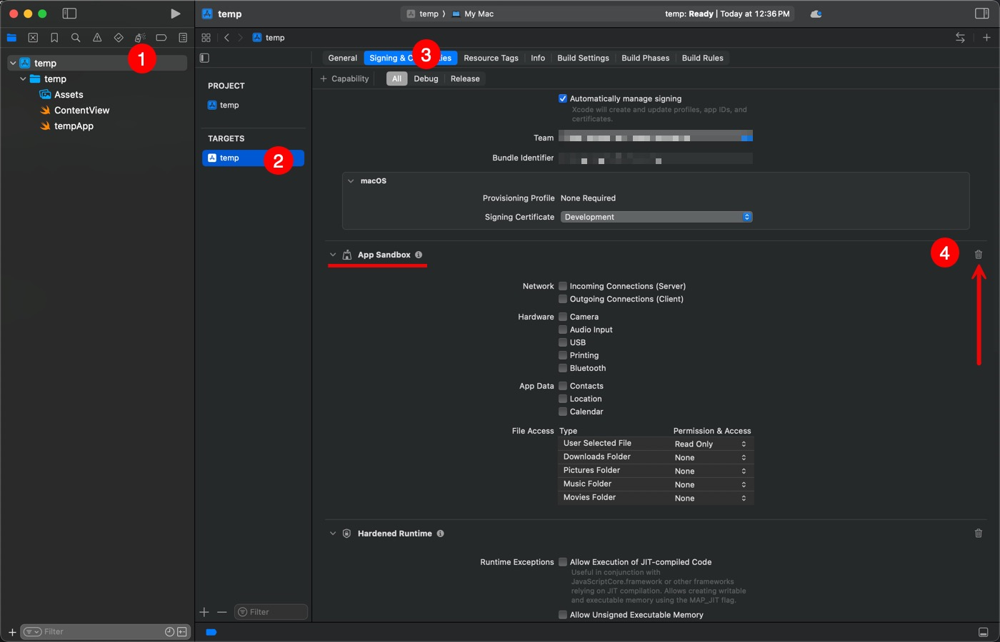

# Add “Open at Login” with a per‑user LaunchAgent

## Who this is for
Use this if:
- Your app is **not sandboxed**.
- You deliberately **don’t** want to use Apple’s `SMAppService` login‑item framework (that’s the Apple‑approved path).
- You want a **simple per‑user LaunchAgent** plist created in `~/Library/LaunchAgents`.

> **App Store?** This **will not pass** App Store review. For MAS, use `SMAppService` (example repo: <a href='https://github.com/gbabichev/LaunchOnLogon-SwiftUI-Sandbox-Demo'>Sandbox Demo</a>)

**Note about System Settings**  
This app will **not** appear under “Open at Login” (the manual list). It shows under:  
**System Settings → General → Login Items → Allow in the Background.**

---

## How it works (short version)
- A small `LaunchAgentManager` exposes **`enable()`** and **`disable()`**.
- When the user checks the box, the app writes a plist to `~/Library/LaunchAgents/<label>.plist` and calls `launchctl bootstrap` in the user GUI domain (`gui/<uid>`).
- The demo **remembers only the user’s choice** (via `@AppStorage`). It **does not verify** the agent at startup. If you delete the plist manually, the checkbox won’t notice until you toggle it again.

---

## Step‑by‑step

1) **Create a new macOS App in Xcode.**  
   - Target: macOS → App  
   - Set your Product Name and Bundle Identifier.

2) **Remove the App Sandbox capability.**  
   - In **Signing & Capabilities**, delete **App Sandbox**.
<div align="center">
  <a href="docs/1.jpg" target="_blank">
    
  </a>
</div>
<br>

3) **Add the code.**  
   - Add `LaunchAgentManager.swift` (minimal version).  
   - Replace `ContentView.swift`.

4) **Build & run.**  
   - Check “Open at login” to create/load the agent.  
   - Uncheck to unload/delete.

---

## Uninstall / cleanup
A) In your app, call `disable()` before uninstall. (Open the app and uncheck the box)

B) Manual cleanup (replace `com.your.bundleid` with your bundle id):
```bash
launchctl bootout gui/$(id -u)/com.your.bundleid.openatlogin
rm -f ~/Library/LaunchAgents/com.your.bundleid.openatlogin.plist
```

---

## Troubleshooting
Validate your plist:
```bash
plutil -lint ~/Library/LaunchAgents/com.your.bundleid.openatlogin.plist
```

Check State:
```bash
launchctl print gui/$(id -u)/com.your.bundleid.openatlogin
```

Tail recent launchd logs:
```bash
log show --last 5m --predicate 'process == "launchd"'
```